# PXL_Datasets  

*Welcome to the PXL_Datasets library! This versatile library enables you to easily download datasets from multiple sources, convert, view, and enhance them. With the standard or your custom loaders, you can standardize the format and streamline your data handling processes for more efficient analysis and machine learning workflows.*   

## Getting started  
The recommended way of using this is by adding it as submodule to your own repository.  
*if you haven't made one for your project it's tim to add it now*  

**1. Adding this as submodule to your repo**  
please run this in the terminal in the folder where your notebook or program you want to use this for is.   
``git submodule add https://github.com/PXLRoboticsLab/PXL_Datasets.git``  
or  
``git submodule add git@github.com:PXLRoboticsLab/PXL_Datasets.git``  

**2. intalling the additional libraries**  
``pip install opendatasets``  
and
``pip install kaggle``  

**3. Importing this into your program or notebook and creating an instance**  
If you want to download *segmentation* dataset:  
``from PXL_datasets.pxl_dataset_segmentation import PXL_segmentation_dataset``  
``dataset = PXL_segmentation_dataset()``  
If you want to download *classification* dataset:  
``from PXL_datasets.pxl_dataset_classification import PXL_classification_dataset``  
``dataset = PXL_classification_dataset()``  
If you want to download *object detection* dataset:  
``from PXL_datasets.pxl_dataset_object_detection import PXL_object_detection_dataset``  
``dataset = PXL_object_detection_dataset()``  

**4. Choose or create a dataset loader**  
If you download from *Kaggle*:  
``from PXL_datasets.pxl_dataset_loader_kaggle import PXL_dataset_loader_kaggle``  
``loader = PXL_dataset_loader_kaggle()``  
If you download from *Huggingface*:  
``from PXL_datasets.pxl_dataset_loader_kaggle import PXL_dataset_loader_huggingface``  
``loader = PXL_dataset_loader_huggingface()``  
If you download from *Roboflow*:  
``from PXL_datasets.pxl_dataset_loader_kaggle import PXL_dataset_loader_roboflow``  
``loader = PXL_dataset_loader_roboflow()`` 

If the provided loader do not load the dataset as wanted. You can override with you own *custom* loader:  
Import a baseclass:  
``from PXL_datasets.pxl_dataset_loader_kaggle import PXL_dataset_loader_kaggle``  
Override functions:  
``class custom_loader(PXL_dataset_loader_kaggle):``  
....``def download_dataset(self, url: str, dataset_source: PXL_dataset_sources, dataset_name: str, save_directory: str):``  
........``#implement you own if needed``  
........``super().download_dataset(url, dataset_source, dataset_name, save_directory)``  
....``def save_dataset(self, dataset_type: PXL_dataset_types, df_map: map, save_directory: str):``  
........``#implement you own if needed``  
........``super().save_dataset(dataset_type, df_map, save_directory)``  
Create an instance of you custom loader  
``loader = custom_loader()``  

**5. Load the dataset**  
``dataset.load_from_url(loader=loader, save_directory='my_dataset_save/', url="https://www.kaggle.com/datasets/<username>/<datasetname>")``  

**6. Display your first random dataset sample**  
``from PXL_datasets.pxl_dataset_split import PXL_dataset_split``  
``dataset.display_random_image(PXL_dataset_split.Train)``  

## Classdiagram  

```mermaid

---
title: PXL_Datasets
---

classDiagram

PXL_datasets--|>PXL_dataset_segmentation
PXL_datasets--|>PXL_dataset_object_detection
PXL_datasets--|>PXL_dataset_classification
PXL_datasets..>PXL_dataset_loader
PXL_dataset_loader--|>PXL_dataset_loader_kaggle
PXL_dataset_loader--|>PXL_dataset_loader_roboflow
PXL_dataset_loader--|>PXL_dataset_loader_huggingface

class PXL_datasets{
    +load_from_url(loader:PXL_dataset_loader, url:str, save_directory:str)
    +load_from_save_dir(save_directory:str)
    +load_from_df_map(df_map:map, save_directory:str, loader:PXL_dataset_loader=PXL_dataset_loader())
    +display_random_image(split:PXL_dataset_split)
}

class PXL_dataset_segmentation{
    +load_from_url(loader:PXL_dataset_loader, url:str, save_directory:str)
    +load_from_save_dir(save_directory:str)
    +load_from_df_map(df_map:map, save_directory:str, loader:PXL_dataset_loader=PXL_dataset_loader())
    +display_random_image(split:PXL_dataset_split)
    +convert_to_object_detection_dataset(loader:PXL_dataset_loader=PXL_dataset_loader())
}

class PXL_dataset_object_detection{
    +load_from_url(loader:PXL_dataset_loader, url:str, save_directory:str)
    +load_from_save_dir(save_directory:str)
    +load_from_df_map(df_map:map, save_directory:str, loader:PXL_dataset_loader=PXL_dataset_loader())
    +display_random_image(split:PXL_dataset_split)
    +replace_object_files(source_directory:str, keep_other_directory:str=None)
}

class PXL_dataset_classification{
    +load_from_url(loader:PXL_dataset_loader, url:str, save_directory:str)
    +load_from_save_dir(save_directory:str)
    +load_from_df_map(df_map:map, save_directory:str, loader:PXL_dataset_loader=PXL_dataset_loader())
    +display_random_image(split:PXL_dataset_split)
}

class PXL_dataset_loader{
    +download_dataset(url:str, dataset_source: PXL_dataset_sources, dataset_name: str)
    +save_dataset(dataset_type: PXL_dataset_types, df_map: map, save_directory: str)
}

class PXL_dataset_loader_kaggle{
    +download_dataset(url:str, dataset_source: PXL_dataset_sources, dataset_name: str)
    +save_dataset(dataset_type: PXL_dataset_types, df_map: map, save_directory: str)
}

class PXL_dataset_loader_roboflow{
    +download_dataset(url:str, dataset_source: PXL_dataset_sources, dataset_name: str)
    +save_dataset(dataset_type: PXL_dataset_types, df_map: map, save_directory: str)
}

class PXL_dataset_loader_huggingface{
    +download_dataset(url:str, dataset_source: PXL_dataset_sources, dataset_name: str)
    +save_dataset(dataset_type: PXL_dataset_types, df_map: map, save_directory: str)
}

class PXL_dataset_sources{
    <<enumeration>>
    Huggingface
    Kaggle
    Roboflow
}


class PXL_dataset_split{
    <<enumeration>>
    Train
    Test
    Validation
}

class PXL_dataset_types{
    <<enumeration>>
    Classification
    Segmentation
    Object_Detection
}

class PXL_dataset_format_exception{
    +__init__(message="...")
}

class PXL_value_exception{
    +__init__(message="...")
}

```

